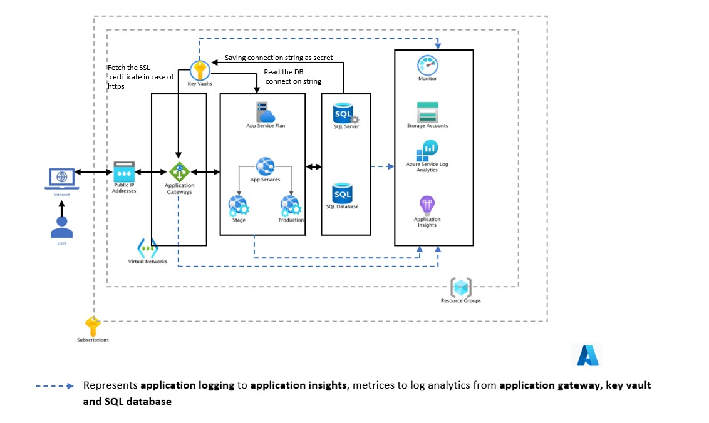
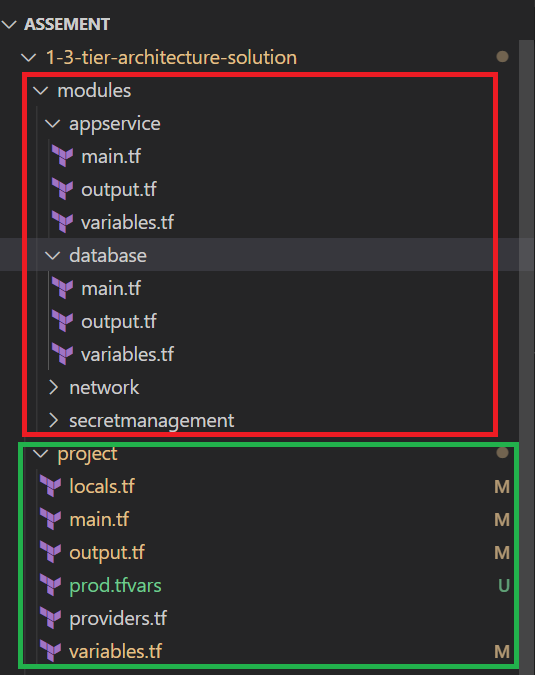

```
A 3-tier environment is a common setup. Use a tool of your choosing/familiarity create these
resources on a cloud environment (Azure/AWS/GCP). Please remember we will not be judged
on the outcome but more focusing on the approach, style and reproducibility.

```



# 3 Tier architecture explanation

# Following are layers considered for creating the architecture

#### public layers
* Application is only accessible from public IP of application gateway.
* Adding the app service to backend pool of application gateway and configurating access restrications.

#### Application layer
* App service with SKU standard, minimal SKU that provides option like auto scaling feature, vnet integration. using windows os
* Access restriction applied to app serivces, App service can accessible only from application gateway.

#### Database layer
* Single sql database server and sql database using sku standard

#### other considerations

#### keyvault :-
* To store the pasword of azure sql database and for the user to access the sql db.
* To store the connection strings of the database and retireved by the app services.
* store the certificates for application gateway or app services, if https need to be configured.
* access the secrets using the managed identity of app service and sql server.

#### logging & monitoring.
* metrices are directed to log analytics workspace from following services.
    - application gateway
    - app service
    - keyvault
    - sql server and database

* application logs are logged to appplication insights.


### terraform project structure explanation


* higligted in **red** from above screenshot is terraform modules
    - creating modules for following resources.
        + appservice module - consists configuration for **app service plan and app service**.
        + database - consists configuration for **sql server and sql db**
        + secretmanagement -  consists configuration for **keyvault**
        + each module contains main.tf, variables.tf and output.tf

* higligted in **green** from above screenshot is project folder, where calling modules and creating the resources.
    - local.tf 
        + creating resoource names based on example for app sercivce plan
        + ``` <locationcode> + "asp" + var.service_name + var.environment + var.instance_number ```
        +  *azus-asp-ardemo-prod-001*
            - location
            - location code (shortend location example eastus is azus)
            - environment (dev, preprod, prod)
            - resource app service = app, app service plan is asp, keyvault is kv and so on
            - instance number - a number to identify same kind of resource example :- 001, 002
    - provider.tf 
        + defined the provider configuration for azurerm module with subscriptionid as input.

    - main.tf
        + called all the modules in main.tf creating the resources.

    - variables.tf
        + defined variables for resuseing the same configuration for other environments.
    - output.tf
        + resources are generated dynamically, so sharing the names as ouput.