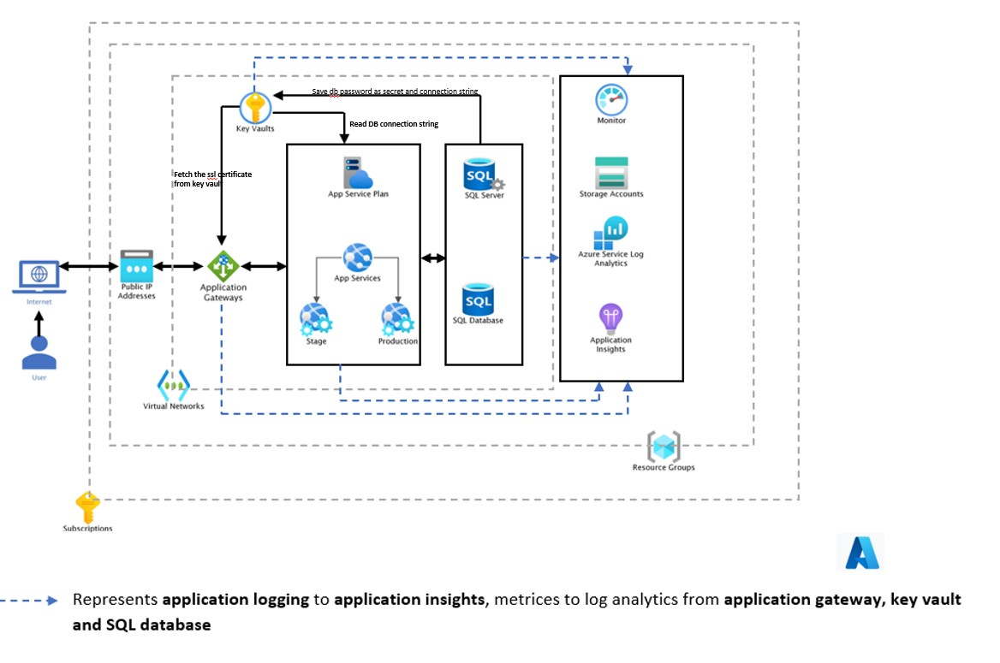

# 3 Tier architecture explanation

# Following are layers considered for creating the architecture

#### public layers
* Application is only accessible from public IP of application gateway.
* Adding the app service to backend pool of application gateway and configurating access restrications.

#### Application layer
* App service with SKU standard, minimal SKU that provides option like auto scaling feature, vnet integration.
* Access restriction applied to app serivces, App service accessible only from application gateway.

#### Database layer
* Single sql database server and sql database using sku standard

#### other considerations.

#### keyvault :-
* To store the pasword of azure sql database and for the user to access the sql db.
* To store the connection strings of the database and retireved by the app services.
* store the certificates for application gateway or app services, for configuring https access.

#### logging & monitoring.
* metrices are directed to log analytics workspace from following services.
    - application gateway
    - keyvault
    - sql server and database

* application logs are logged to appplication insights.
